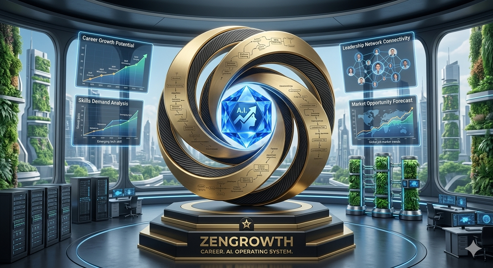

<p align="center">
  
</p>

<h1 align="center">ZenGrowth</h1>

<p align="center">
  <a href="https://github.com/zenouz-ai/zengrowth/actions/workflows/ci.yml"></a>
  <a href="LICENSE"></a>
  
  
</p>

<p align="center">
  <b>ZenGrowth is a transparent, local-first, auditable AI career operating system.</b><br>
  It discovers senior AI and Data-Science roles from ATS feeds, scores them with Claude using an explainable
  priority score, and turns a job description into a tailored CV and cover letter constrained by reviewed
  evidence and operator approval.
</p>

> **Curated public mirror.** This repo ships the engine, dashboard, tests, and docs — with **no** personal
> job-search data, generated materials, recruiter notes, or deployment runbooks. All examples use synthetic
> candidates, roles, and companies. See [`docs/PUBLIC_REPO_SCOPE.md`](docs/PUBLIC_REPO_SCOPE.md).

## Why you'll like it

- ⚡ **Measure the whole workflow.** Paste a job description, score it, generate materials, and review them before use. Per-call spend is visible on the dashboard; end-to-end time, review burden, and per-application cost remain under formal evaluation.
- 🚀 **Up and running fast — no config files to edit.** Start the API and dashboard, then paste your Claude key into the setup wizard (validated live, stored encrypted). No `.env` editing required to reach value.
- 🎛️ **Personal, and it learns you.** Set your target roles, sectors, comp, and location once. Feed it CVs and project write-ups and it builds an evidence bank ranked against each job — never boilerplate.
- 🔐 **Secure and private by default.** Local-first: your CV, materials, facts, and database stay on your disk. Every API route is gated, the app fails closed in production, and API keys are encrypted at rest.
- 🛟 **Never miss the window.** Nightly discovery has a dead-man's-switch heartbeat, a `/health/ready` probe, and a dashboard banner the moment a source goes quiet.
- 🧾 **Transparent and review-first.** Scores retain rationales; generation uses reviewed evidence; numeric/entity gates catch selected fabrication classes; logged workflow events support audit. Sentence-level factual support still requires human review.

## The problem

Senior job hunting is high-effort and low-signal. Roles are scattered across ATS feeds and descriptions are noisy. ZenGrowth supports **discover → score → tailor → review** while keeping outbound submission under human control.

<p align="center">
  
</p>

## How it works

1. **Discover** — roles arrive from Greenhouse/Lever ATS pulls or paste-to-fill.
2. **Filter** — duplicates are skipped; obvious non-targets are archived with no LLM cost.
3. **Score** — Claude cleans the description and returns an explainable fit score and ranking priority.
4. **Tailor** — one click generates a CV and cover letter grounded in your approved evidence.
5. **Review** — preview, revise in plain language, export PDF/TeX/Markdown, mark final.
6. **Interview** — track every round on an interactive, backdatable journey timeline; generate
   web-researched prep packs with cited sources, paste transcripts for structured debriefs,
   draft follow-up emails, and promote durable learnings into your reviewed fact bank.
7. **Decide** — paste or upload the offer to prefill its terms, benchmark the package
   against the market and your expectations, and draft the acceptance or counter-offer
   email (you send it yourself). Revised offers are judged against the prior round and
   your sent counter — not just the market.
8. **Start strong, leave well** — on acceptance, generate an onboarding pack (a 30/60/90
   plan built from everything the process taught you) and a departure pack (resignation
   letter, handover plan, and leaving checklist for the role you're leaving).

Meaningful workflow transitions are written to a live audit log on the dashboard; log completeness is audited rather than assumed.

In a deployed setup, nginx is the only public surface (TLS, headers, rate limits, SPA, `/api/*` proxy) in front of an internal-only FastAPI app. See [`docs/ARCHITECTURE.md`](docs/ARCHITECTURE.md) for the full request and data-flow diagram.

## What's inside

- **Compliant discovery.** Greenhouse + Lever public JSON only — no scraping. Tavily is optional and link-only. Stale/duplicate postings are skipped; new rows auto-precheck. → [`docs/ATS_INGESTION.md`](docs/ATS_INGESTION.md)
- **Explainable scoring.** One strict-JSON Claude call returns per-dimension scores, a stored rationale, and an observable-fit priority score. `temperature=0` is a reproducibility control, not a guarantee of identical provider outputs. → [`docs/SCORING_AND_EXPECTED_VALUE.md`](docs/SCORING_AND_EXPECTED_VALUE.md)
- **Evidence-constrained materials.** Structure-preserving CV tailoring, cover letters, and answers draw from reviewed evidence; deterministic gates detect selected unsupported numeric/entity tokens, while operator review remains responsible for sentence-level support. → [`docs/MATERIAL_GENERATION.md`](docs/MATERIAL_GENERATION.md)
- **A knowledge bank that learns you.** Sources are parsed, chunked, and extracted into facts with provenance; high-confidence facts auto-approve, the rest queue for review.
- **Interview workflow.** A per-job journey visual (stages, milestones, files, learnings) over a dated, backdatable timeline of rounds; prep packs (company briefing, interviewer, technical, final-round) generated with Claude web search and inline citations; transcript-to-debrief analysis; never-sent email drafts; and a zero-cost voice-interviewer simulation prompt. Mobile-friendly layout with PWA icons and safe-area insets.
- **Offer stage.** Paste an offer email or upload the PDF letter to prefill its terms (review-first; never ingested as evidence), generate a market-benchmarked evaluation with cited web sources, and draft the acceptance / counter-offer / clarification email — nothing is ever sent by the app. Revised offers are **negotiation-aware**: prior rounds and your sent counters feed a **Movement From Last Round** comparison. On acceptance, a 30/60/90 onboarding pack carries the whole process into day one, and a departure pack covers leaving the current role well (resignation letter, manager conversation, handover, checklist).
- **Insights, cost & reliability.** Live funnel, per-call LLM cost/latency, pipeline waterfalls, and datasource health — streamed over the audit feed.
- **Security & ops, built in.** Fail-closed boot, encrypted keyring, login backoff, a k-anonymized public view, ingestion heartbeat, and a default-off daily LLM-spend ceiling. → [`docs/PRIVACY_AND_DATA.md`](docs/PRIVACY_AND_DATA.md)

## Quick start (local)

**Prerequisites:** Python ≥3.11 + [Poetry](https://python-poetry.org/), Node 20.19+ (or 22.12+), and a Claude (Anthropic) API key.

```bash
cp .env.example .env          # placeholders only; fill in your Claude key

# Backend (terminal 1) — API on :8000
poetry install --with dev
poetry run python -m zengrowth.db init
poetry run uvicorn zengrowth.api.main:app --reload

# Dashboard (terminal 2) — http://localhost:3000, proxies /api to :8000
cd frontend && npm install && npm run dev
```

Open **http://localhost:3000** (in dev you're not asked to log in), connect your Claude key in the Setup wizard, paste your first job, then upload documents on *Knowledge*. Full walkthrough: [`docs/LOCAL_SETUP.md`](docs/LOCAL_SETUP.md).

## Validation

```bash
poetry run ruff check src tests branding
poetry run pytest
cd frontend && npm run lint && npm run test && npm run build
```

CI runs the same checks on every push and PR.

## Tech stack

| Layer | Tools |
|-------|-------|
| Backend | Python ≥3.11, FastAPI, SQLModel, Pydantic v2, APScheduler, httpx |
| Models | Anthropic Claude (default `claude-sonnet-4-6`); OpenAI embeddings optional, off by default |
| Data | Greenhouse + Lever ATS JSON, optional Tavily; SQLite canonical store, local-disk materials |
| Frontend | React 19, Vite, Tailwind, TypeScript, react-router, recharts |
| Infra | Docker Compose, GitHub Actions CI (ruff + pytest + frontend lint/test/build) |

## Public / private split

ZenGrowth is developed in a **private canonical repo** and published here as a **curated public mirror** via an allowlisted, sanitized export. The mirror omits personal career data, generated materials, job-pipeline data, contacts, browser/session state, local databases, logs, secrets, and deployment runbooks — see [`docs/PUBLIC_REPO_SCOPE.md`](docs/PUBLIC_REPO_SCOPE.md) and [`docs/PRIVACY_AND_DATA.md`](docs/PRIVACY_AND_DATA.md).

## Documentation

The current [working paper](output/pdf/zengrowth-grounded-not-automated-v0.2.pdf),
its [source](papers/arxiv/), and the
[academic publication plan](docs/ACADEMIC-PUBLICATION-PLAN.md) are public so
the claims and proposed evaluation can be inspected before results are added.

| Doc | What's in it |
|-----|--------------|
| [`PUBLIC_REPO_SCOPE`](docs/PUBLIC_REPO_SCOPE.md) | What this mirror includes and omits |
| [`ARCHITECTURE`](docs/ARCHITECTURE.md) | Services, request flow, failure modes |
| [`LOCAL_SETUP`](docs/LOCAL_SETUP.md) | Install, env, first-run walkthrough |
| [`DASHBOARD`](docs/DASHBOARD.md) | Page map and API split |
| [`ATS_INGESTION`](docs/ATS_INGESTION.md) | Greenhouse/Lever ingestion, dedupe, scheduling |
| [`SCORING_AND_EXPECTED_VALUE`](docs/SCORING_AND_EXPECTED_VALUE.md) | Scoring dimensions and priority score |
| [`MATERIAL_GENERATION`](docs/MATERIAL_GENERATION.md) | Evidence-grounded material generation |
| [`AUDIT_LOGGING`](docs/AUDIT_LOGGING.md) | What is logged, why, retention |
| [`PRIVACY_AND_DATA`](docs/PRIVACY_AND_DATA.md) | Local-first design, data boundaries |
| [`ROADMAP`](docs/ROADMAP.md) | Shipped vs planned |
| [`ACADEMIC_PUBLICATION_PLAN`](docs/ACADEMIC-PUBLICATION-PLAN.md) | Novelty boundary, study design, reproducibility, and venue ladder |

## Contributing

See [`CONTRIBUTING.md`](CONTRIBUTING.md). Report security issues privately per [`SECURITY.md`](SECURITY.md). Never commit `.env`, secrets, real personal data, or generated materials (all gitignored).

## License

Released under the [MIT License](LICENSE). © 2026 Zenouz AI.
