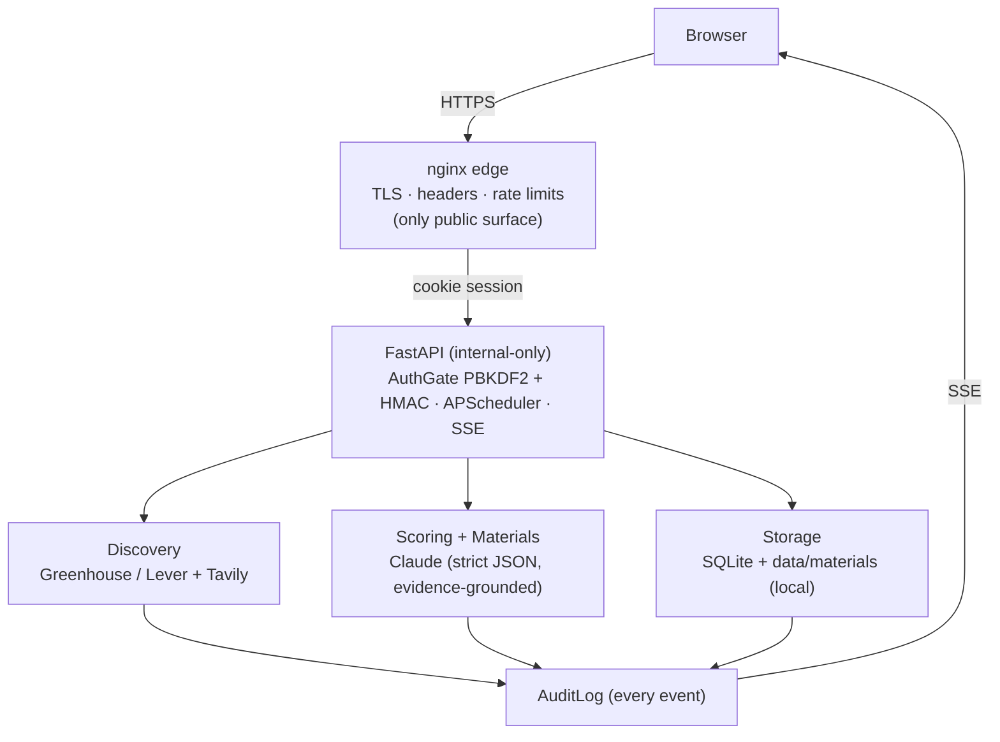

# Architecture

ZenGrowth is a local-first FastAPI service with a React/Vite dashboard and a
SQLite store. Everything personal stays on local disk; the only outbound calls
are the LLM (Anthropic) and optional discovery (Tavily) requests the operator
triggers.

## Request & data flow



A job moves through the pipeline as follows:

```
ATS pull / paste-to-fill
        │
        ▼
   Dedup + precheck ──► (obvious non-targets archived, no LLM cost)
        │
        ▼
   Clean + score (Claude, strict JSON, temperature=0)
        │
        ▼
   Curated board  ──► Prepare → Generate materials (evidence-grounded)
        │
        ▼
   Review / revise / mark final
        │
        ▼
   Interview rounds (dated timeline, prep packs, debriefs, learnings)
        │
        ▼
   Offer stage (record terms → market evaluation → response drafts)
        │
        ▼
   Every step ──► AuditLog ──(SSE)──► dashboard
```

## Components

### API (`src/zengrowth/api/`)
- `main.py` — app factory and a fail-closed lifespan: when
  `ZENGROWTH_REQUIRE_HTTPS=true`, the app refuses to boot without an operator
  password hash and session secret.
- `middleware.py`, `security.py`, `login_throttle.py`, `routers/auth.py` —
  protected-by-default routes, PBKDF2-SHA256 password hashing, HMAC-signed
  session cookies, and login backoff.
- `routers/` — `jobs`, `ingestion`, `discovery`, `knowledge`, `interviews`,
  `observability`, `audit`, `events` (SSE), `health`, `public`, `settings`.
- `kanon.py` — k-anonymized aggregation with complementary suppression behind the
  `/public` surface.

### Ingestion (`src/zengrowth/ingestion/`)
- `ats_greenhouse.py`, `ats_lever.py` — public ATS JSON clients.
- `dedup.py` — duplicate detection across pulls.
- `precheck.py` — cheap, LLM-free archiving of obvious non-target roles.
- `job_summarizer.py`, `job_description_extractor.py` — cleaning/structuring.
- `runner.py`, `locking.py`, `health.py` — orchestration, an advisory lock with
  TTL self-heal, catch-up on boot, and staleness/heartbeat detection.
- `tavily_search.py` — optional, link-only discovery.

See [ATS_INGESTION.md](ATS_INGESTION.md).

### Scoring (`src/zengrowth/scoring/`)
- `prompts.py`, `scorer.py` — one strict-JSON Claude call returns per-dimension
  scores plus a rationale stored on the row.
- `expected_value.py` — priority score: a weighted sum of the observable fit
  dimensions (0–100). `success_probability` is demoted to a coarse chances band
  used only as a tie-breaker; `application_effort` is a separate cost axis,
  never a divisor.

See [SCORING_AND_EXPECTED_VALUE.md](SCORING_AND_EXPECTED_VALUE.md).

### Materials (`src/zengrowth/materials/`)
- `generator.py`, `cv_alignment.py`, `evidence.py` — evidence-grounded CV/cover
  letter/answer generation; structure-preserving CV tailoring.
- `latex.py`, `files.py`, `revise.py`, `retention.py` — LaTeX/PDF rendering,
  on-disk artifacts, plain-language revision, and retention.

See [MATERIAL_GENERATION.md](MATERIAL_GENERATION.md).

### Interviews (`src/zengrowth/interviews/`)
- `service.py` — dated, backdatable rounds on a job timeline; outcome-stage sync
  (forward-only, skips terminal jobs); artifact import; promote-learning into the
  fact queue (tagged `job-{id}`).
- `material_policy.py` — three-tier content policy: foundation / round prep
  (schemas keyed by `pack_type` + `round_type`) / hybrid debrief; line budgets,
  quality gates, learning-loop helpers (snippet extraction, dedup).
- `packs.py` — internal prep packs (company briefing, interviewer, technical,
  final-round) via `InstrumentedLLM.chat_with_web_search` with citation harvest,
  provenance profile, optional *enhance* mode, and expanded learning loop inputs.
- `debrief.py` — transcript/notes → structured debrief (gap-recovery schema);
  email drafts with a never-sent banner.
- `offers.py` — offer stage: record terms (`JobOffer`), market-benchmarked
  evaluation via web search with provenance labelling (negotiation-aware when
  prior offers / sent counters exist — **Movement From Last Round**), and
  acceptance / counter-offer / clarification drafts (never sent); offer status
  syncs the outcome funnel. Onboarding and departure packs close the arc.
- `offer_extractor.py` — paste/PDF offer-letter intake (review-first; never
  ingested as evidence).
- `departure.py` — leave-well pack (resignation, handover, checklist).
- `sim_prompt.py` — deterministic, zero-LLM mock-interviewer prompt for
  external voice/chat tools.

Internal materials (`audience=internal`) render on the Job-detail interview
timeline, not the employer Materials panel. Employer CVs/cover letters keep the
full grounding and revision flow.

### Knowledge (`src/zengrowth/knowledge/`)
- `parsers.py`, `chunking.py`, `extractor.py`, `dedup.py`, `entity_resolution.py`,
  `provenance.py`, `local_graph.py`, `service.py`, `seed.py` — parse → chunk →
  extract facts with source provenance; high-confidence facts auto-approve only
  when the cited span exists in the source and the claim's figures/entities
  match that span (distorted claims stay draft, flagged in the audit log);
  alias/fuzzy entity resolution merges surface variants of the same entity.
- `facets.py`, `coverage.py` — coverage-map faceting against a closed,
  operator-extendable vocabulary (out-of-vocabulary values rejected; one
  strict-JSON temp-0 call per document/job, key-guarded and never fatal to
  ingest or scoring; backfill CLI) and the aggregation behind
  `GET /api/knowledge/coverage` (facet counts, evidence-over-time,
  coverage-vs-demand gaps).
- `embeddings.py` — optional, off by default; not read by any retrieval path yet.

### Observability (`src/zengrowth/observability/`)
- `client.py`, `tracing.py`, `pricing.py`, `budget.py`, `datasources.py` —
  per-call LLM cost/latency (including web-search tool usage on prep packs), a
  soft daily spend ceiling, and datasource health.

See [AUDIT_LOGGING.md](AUDIT_LOGGING.md).

### Persistence
- `models.py` (SQLModel) + `db.py` define the SQLite schema and init.
- `audit.py` records every ingest, score, and edit; the audit feed streams to the
  dashboard over SSE.

## Deployment posture (summary)

In a deployed setup, nginx is the single public surface (TLS, security headers,
rate limits, SPA, `/api/*` proxy) and the FastAPI service is internal-only. The
production proxy/TLS configuration is **not** part of this public mirror; this
repo ships the local-first path documented in [LOCAL_SETUP.md](LOCAL_SETUP.md).
